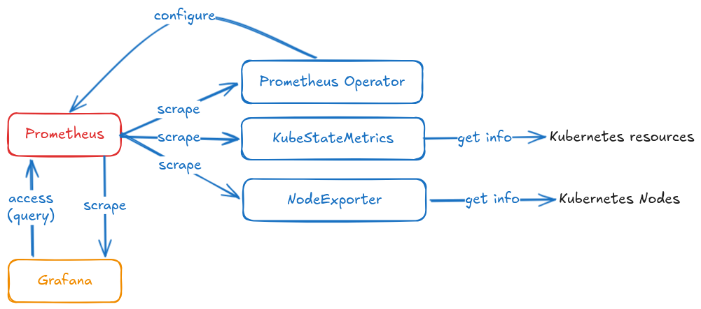

# Metrics setup of dreams

This is my best approach for monitoring and observability tools in a Kubernetes cluster! :)

*Still in development! I hope some day it will be finished (and I hope to have RAM memory enough).*

Repo: https://github.com/ViniciusPilan/metrics-setup-of-dreams

---

# Architecture

## v0

A version of the cluster setup where we can monitore the cluster health and behavior using metrics (nodes, workloads, etc.), using the minimal tools for that.

Useful to understand bottle necks at a infrastructure level (resource utilization).

This setup is focused on observality in the present time, not focusing on metrics retention for long periods.
